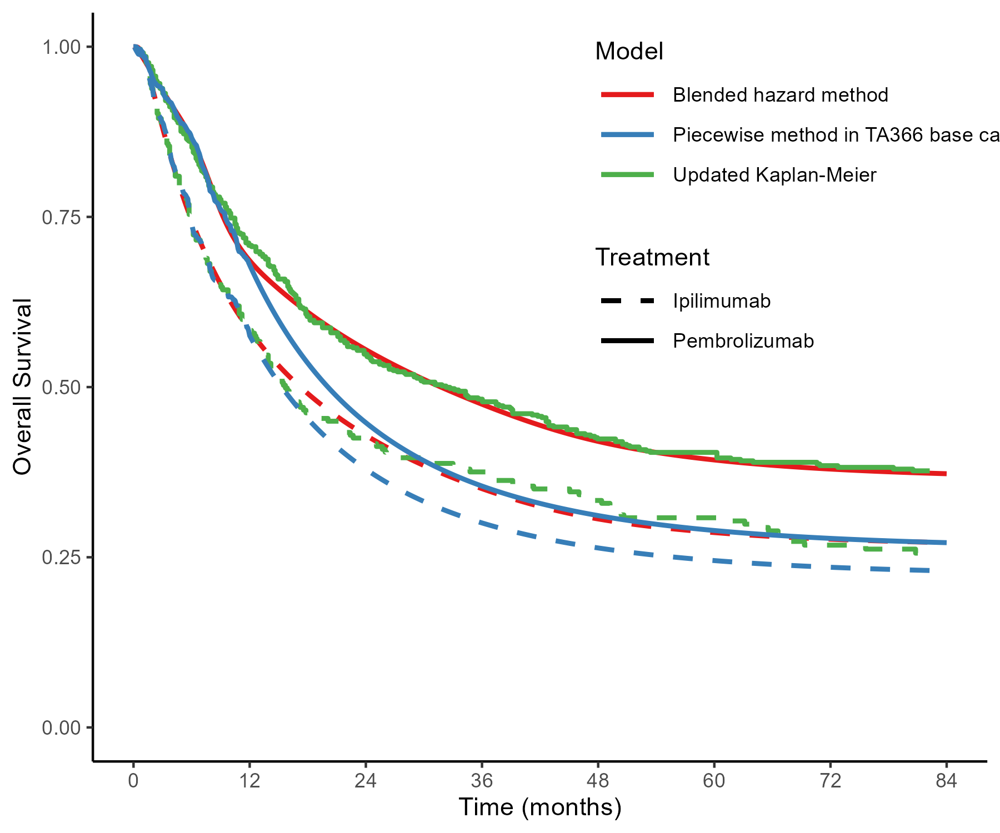

# BlendTrtWaning

This repository contains the data and code used to generate the results for the paper: **Flexible Survival Extrapolation with Blended Hazards: Accounting for Treatment Effect Waning in Health Technology Assessment**. 

This work demonstrates the blended hazard method as a flexible way to account for treatment effect waning while incorporating external evidence in survival extrapolation.



## Repository Structure

```text
├── data/                 # Digitise data from published Kaplan-Meier
├── code/                 # R code
├── docs/                 # Rmd document for model selection and blending process
├── figures/              # Survival and hazard plots for base case and sensitivity analysis scenarios
├── tables/               # 7-year RMST tables
├── BlendTrtWaning.Rproj  # Project organisation container
├── README.md
```

## R Shiny App

An additional illustrative Shiny App for sensitivity analysis can be accessed [here](https://jzhu919.shinyapps.io/shinyapp/).