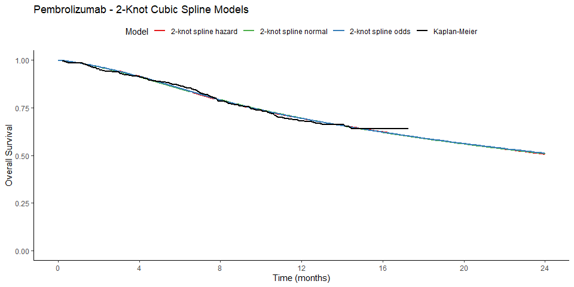

BlendTrtWaning
================

## Packages

- `survminer` for Kaplan-Meier visualisation
- `survHE` for parametric modelling of survival data
- `muhaz` for non-parametric smoothed hazard estimation
- `landest` for survival estimation from Kaplan-Meier
- `RColorBrewer` for colour mapping
- `pracma` for numerical estimation of restricted mean survival time
- these also include dependencies: `ggplot2`, `ggpubr`, `survival`,
  `flexsurv`, `dplyr`

## 0. Digitised Kaplan-Meier Visualisation

- **Internal data:** KEYNOTE-006 trial IA2 (2015)
- **External data:** Schadendorf pooled analysis of ipilimumab-treatment
  naive population (2015)

<!-- --><!-- -->

## 1. Internal model for Pembrolizumab arm

**Shape of nonparametric smoothed hazard:** increasing then decreasing

<!-- -->

### 1.1. Standard parametric models

<!-- --><!-- -->

    ##                        AIC      BIC
    ## Generalised Gamma 833.1065 843.9785
    ## Log-Logistic      830.8924 838.1405
    ## Log-Normal        832.4267 839.6748

### 1.2. 1-knot cubic spline models

<!-- --><!-- -->

    ##                           AIC      BIC
    ## 1-knot spline hazard 833.5956 844.4677
    ## 1-knot spline odds   832.8660 843.7381

### 1.3. 2-knot cubic spline models

<!-- --><!-- -->

    ##                           AIC      BIC
    ## 2-knot spline hazard 833.8412 848.3373
    ## 2-knot spline odds   833.8942 848.3903
    ## 2-knot spline normal 833.9449 848.4409

### 1.4 3-knot cubic spline models

<!-- --><!-- -->

    ##                           AIC      BIC
    ## 3-knot spline hazard 831.8308 849.9509
    ## 3-knot spline odds   831.7754 849.8955
    ## 3-knot spline normal 831.7432 849.8633

## 2. Internal model for Ipilimumab arm

**Shape of nonparametric smoothed hazard:** increasing then decreasing

<!-- -->

### 2.1. Standard parametric models

<!-- --><!-- -->

    ##                        AIC      BIC
    ## Generalised Gamma 922.8651 933.7480
    ## Log-Logistic      931.2660 938.5213
    ## Log-Normal        924.7942 932.0495

### 2.2. 1-knot cubic spline models

<!-- --><!-- -->

    ##                           AIC      BIC
    ## 1-knot spline hazard 925.0020 935.8849
    ## 1-knot spline odds   924.9581 935.8409
    ## 1-knot spline normal 923.5203 934.4032

## 3. External model for both arms

**Shape of nonparametric smoothed hazard (after 13.85 months):**
decreasing

<!-- -->

### 3.1. Standard parametric models rebased at KEYNOTE-006 median follow-up (13.85 months)

<!-- --><!-- -->

    ##                          AIC      BIC
    ## Rebased Weibull     984.3187 991.4857
    ## Rebased Gompertz    971.9315 979.0984
    ## Rebased Gen Gamma   980.4631 991.2136
    ## Rebased Loglogistic 977.8875 985.0545
    ## Rebased Lognormal   978.7732 985.9402

## 4. Blended method implementation

**Selected models**  
**Selected internal model for pembrolizumab arms:** 3-knot spline
normal  
**Selected internal model for ipilimumab arm:** generalised Gamma  
**Selected external model for both arms:** Gompertz model rebased at
13.85 months

**Configuration of parameters**  
**Blending interval:** (24 months, 60 months)  
**Beta parameters:** (5, 5)

<!-- -->

## 5. Blended method vs updated data vs TA366 base case

### 5.1. Reproduce TA366 base case

**TA366 base case:** Kaplan-Meier before 12 months, followed by the best
standard parametric model rebased at 12 months

**Nonparametric smoothed hazard:** decreasing

<!-- --><!-- --><!-- -->

    ##                          AIC      BIC
    ## Rebased Weibull     1153.660 1161.074
    ## Rebased Gompertz    1125.516 1132.930
    ## Rebased Gen Gamma   1132.635 1143.756
    ## Rebased Loglogistic 1139.557 1146.971
    ## Rebased Lognormal   1133.706 1141.120

### 5.2. Comparison on hazard scale

<!-- -->

### 5.3. Comparison on survival scale

<!-- -->

### 5.4. Comparison of restricted mean survival time at 7 years

    ##                 Pembrolizumab RMST 7y Ipilimumab RMST 7y Incremental RMST 7y
    ## Blended Method                   3.59               2.83                0.76
    ## 7-Year Updated                   3.61               2.84                0.77
    ## TA366 Base Case                  2.98               2.57                0.41
